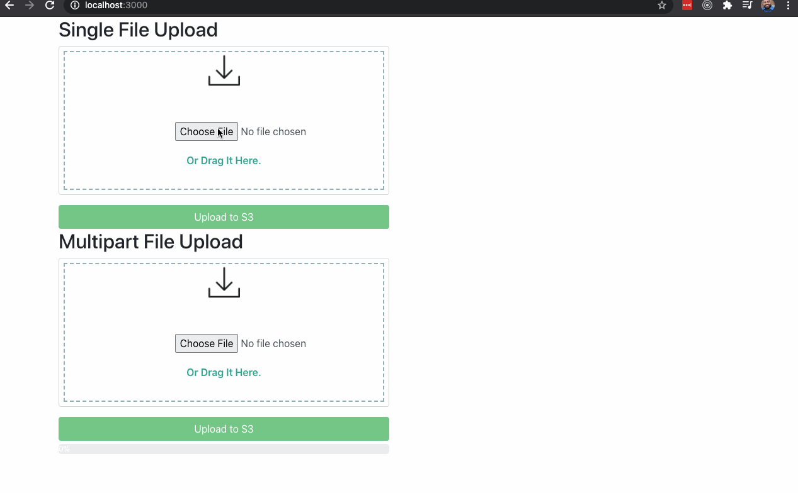
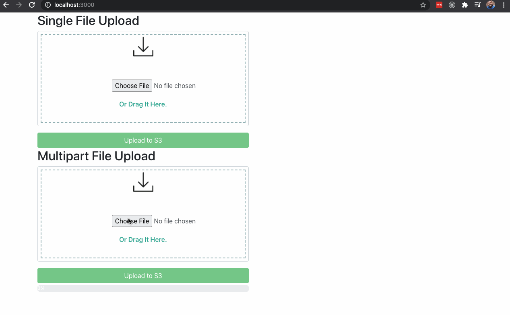

# Brighthive Secure File Uploader Example

A quick and dirty file uploader example using [Brighthive](https://github.com/brighthive)'s secure file uploader backend.

## About

This simple application demonstrates how a front-end web application may interact with [Brighthive](https://github.com/brighthive)'s Secure File Uploader API.

**Disclaimer:** This application is strictly for demonstration purposes and should not be used in a production setting.

## About the File Uploader

The file uploader exposes a REST API that allows users to upload files in a single thread or multipart upload mode. All uploaded files are stored in a secure AWS S3 bucket.

### Single Thread Upload Mode

Single thread upload mode attempts to upload a file with a single API call to retrieve a secure presigned URL. It is the simplest workflow for clients, but does not allow for optimizing uploads by parallelization. It also does not provide any hooks for determining the progress of the upload. In effect, single thread mode is a blocking operation that should only be used for relatively small files.

### Multipart Upload Mode

Multipart upload mode allows users to upload files in discrete chunks. It is the more complex workflow because it requires file chunking to be done client side and leaves the management of the entire upload process up to the web client. On the upside, this mode allows for parallelization and the ability to infer upload progress from the API. This is the more suitable mode for large files.

## Demo Project

The demo project demonstrates both upload modes. A component has been implemented for each upload type (see [src/components/SingleUploadForm.js](./src/components/SingleUploadForm.js) and [src/components/MultiPartUploadForm.js](./src/components/MultiPartUploadForm.js)).

The logic for uploads, including the necessary API calls are found at [src/services/services.js](./src/services/services.js).

### Configuration

In order to run the app locally, create an `env.development.local` environment file in the application root and provide the environment variables listed in the table below.

| Environment Variable     | Description                                                                                                                                             |
| ------------------------ | ------------------------------------------------------------------------------------------------------------------------------------------------------- |
| REACT_APP_S3_SERVICE_URL | The URL for the Brighthive Secure File Uploader service.                                                                                                |
| REACT_APP_CLIENT_ID      | The client ID for the Brighthive OAuth2 client.                                                                                                         |
| REACT_APP_CLIENT_SECRET  | The client secret associated with the Brighthive OAuth2 client. Note this should never be exposed in a production web application.                      |
| REACT_APP_OAUTH2_URL     | The URL for the Brighthive OAuth 2 server.                                                                                                              |
| REACT_APP_GRANT_TYPE     | The OAuth2 grant type associated with the client. For this demo use `client_credentials`. In a live web application this grant type should not be used. |

For security reasons, please ensure that these environment variables are never committed to the code repository.

### Running the Application

Run the application either with `npm start` or `yarn start`.

### Tests

This application has no unit tests; therefore, use with caution.